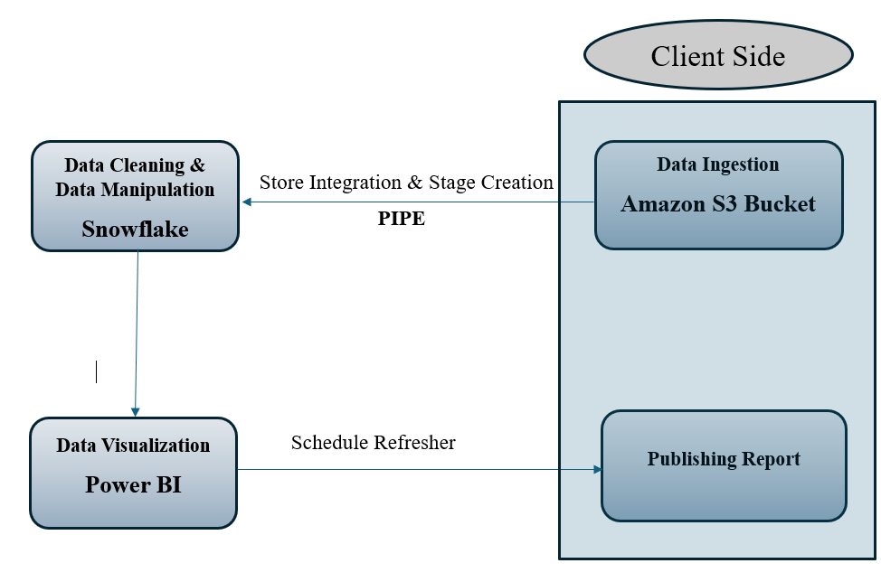

## **Czechoslovakia Banking Financial Data Analysis :**

### **Problem Statement :**

The Czechoslovakia Bank wants to analyse its financial data to gain insights and make informed 
decisions. The bank needs to identify trends, patterns, and potential risks in its financial 
operations. They also want to explore the possibility of introducing new financial products or 
services based on their analysis. (I have already attached detailed problem statement in this repository).

### **My Approach :**

#### **`1.Data Ingestion :`**
Data were stored in Amazon S3 buckets and I had to establish a connection between `amazon S3 bucket` and `snowflake` for `continuous data ingestion`.

#### **`2.Data Cleaning` & `Data Manipulation :`**

For Data cleaning and data manipulation, I used `snowflake` tool where I transformed some columns like `Birthday`-->`Age`, `Birth code`--->`Date of birth` and so on.

#### **`3. Data Visualization :`**

I used `Power BI` tool for `data visualization` where I have used various charts like `cards for numbers`, `line chart for trends`, `bar chart for finding top n values` and many more.

#### **`Diagram of the workflow :`**

#### ** `ER diagram of datasets`:

## **USE MY REPORT [HERE](https://app.powerbi.com/view?r=eyJrIjoiZjI2NWUwMWMtYjY0YS00MTkxLWFkZjMtZWMwM2I3NGRkNDRlIiwidCI6ImY4N2I2ZjgyLTIxNTUtNDc5Zi1iYThiLTRkNTdkN2Q2OWUwZiJ9)**

## **Some sample snapshots of my work :**

